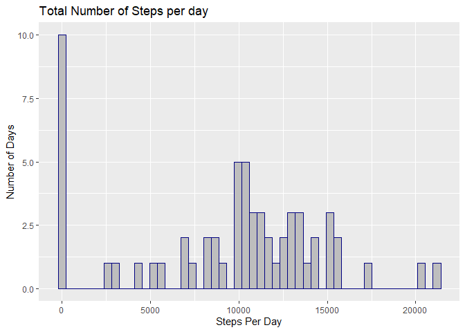
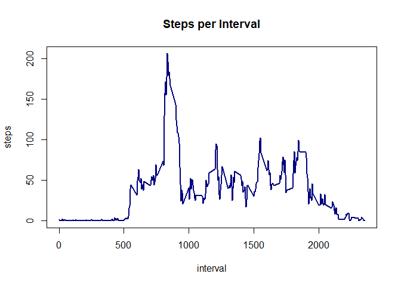
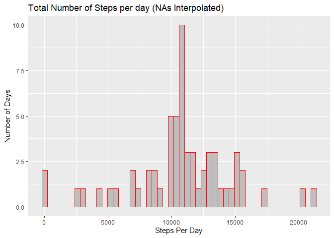
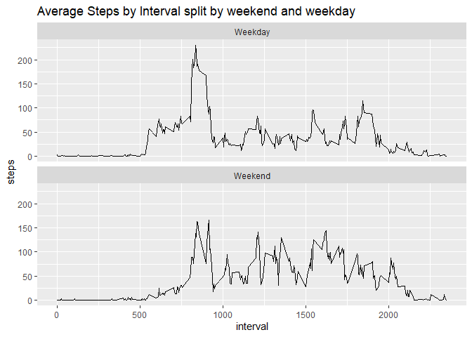

## Loading and preprocessing the data

The following code reads in the raw CSV file and classifys the columns


```r
raw.data <- read.csv("activity.csv", colClasses = c("numeric", "Date", "numeric"))
```

## What is mean total number of steps taken per day?

Histogram of steps per day 


```r
library(dplyr)
```

```
## 
## Attaching package: 'dplyr'
```

```
## The following objects are masked from 'package:stats':
## 
##     filter, lag
```

```
## The following objects are masked from 'package:base':
## 
##     intersect, setdiff, setequal, union
```

```r
library(ggplot2)

data <- raw.data %>%
        select(steps, date) %>%
        group_by( date) %>%
        summarise(steps = sum(steps, na.rm=TRUE))
 
g <- ggplot(data = data, aes(x=steps)) 
g + geom_histogram( bins = 50, fill = "grey", color = "navy") +
        labs(title = "Total Number of Steps per day", x="Steps Per Day", y ="Number of Days")
```

<!-- -->

```r
mean.steps <- as.integer(mean(data$steps, na.rm=TRUE))
median.steps <- as.integer(median(data$steps, na.rm=TRUE))
```

**The mean steps per day is 9354 and the median is 10395**

## What is the average daily activity pattern?


```r
data.interval <- raw.data %>%
        select(interval, steps) %>%
        group_by(interval) %>%
        summarise( steps = mean(steps, na.rm=TRUE) )

with(data.interval, plot(interval, steps, type ='l', main = "Steps per Interval", col = "navy", lwd=2))
```

<!-- -->

```r
data.max <- data.interval %>%
        filter( steps == max(steps))

max.interval = data.max$interval
```

**The interval with the maximum steps over all days in 835**

## Imputing missing values


```r
number.na <- sum(is.na(raw.data$steps))
percentage.na <- round( number.na / length(raw.data$steps), 3) * 100
```

**The number of NAs in the data is 2304**


```r
filled.data <- raw.data %>%
        group_by( interval) %>%
        mutate( steps = ifelse( is.na(steps), mean(steps, na.rm=TRUE) , steps ))

data.filled <- filled.data %>%
        select(steps, date) %>%
        group_by( date) %>%
        summarise(steps = sum(steps, na.rm=TRUE))
```

```
## Adding missing grouping variables: `interval`
```

```r
g <- ggplot(data = data.filled, aes(x=steps)) 
g + geom_histogram( bins = 50, fill = "grey", color = "red") +
        labs(title = "Total Number of Steps per day (NAs Interpolated)", x="Steps Per Day", y ="Number of Days")
```

<!-- -->

```r
mean.steps.filled <- as.integer(mean(data.filled$steps, na.rm=TRUE))
median.steps.filled <- as.integer(median(data.filled$steps, na.rm=TRUE))

mean.change <- mean.steps.filled - mean.steps
median.change <- median.steps.filled - median.steps
```

**The NA values have been replaced with the mean of that for the interval across all days**  
**The new mean is 10766 and the new median 10766**

**This relates to a change in mean of 1412 and median 371**


## Are there differences in activity patterns between weekdays and weekends?


```r
weekend.data <- filled.data %>%
        mutate( weekday = as.factor(ifelse(weekdays(date) %in% c("Saturday", "Sunday"), "Weekend", "Weekday"  )  ))

weekend.interval <- weekend.data %>%
        group_by(interval, weekday) %>%
        summarise( steps = mean(steps, na.rm=TRUE) )


g <- ggplot(data = weekend.interval, aes(interval,steps))
g + geom_line() + facet_wrap(vars(weekday), nrow=2) +
        labs( title = "Average Steps by Interval split by weekend and weekday")
```

<!-- -->


